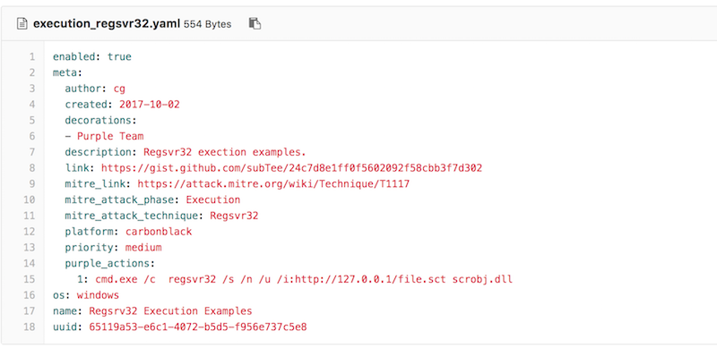
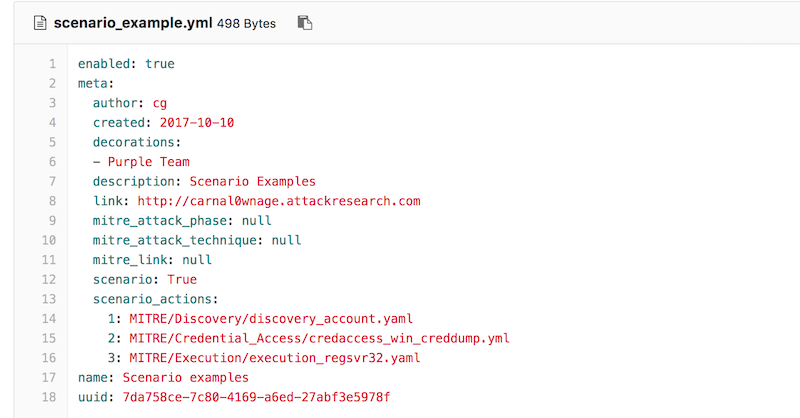

# Metta 

Metta is an information security preparedness tool.  

This project uses Redis/Celery, python, and vagrant with virtualbox to do adversarial simulation.  This allows you to test (mostly) your host based instrumentation but may also allow you to test any network based detection and controls depending on how you set up your vagrants.

The project parses yaml files with actions and uses celery to queue these actions up and run them one at a time without interaction.


---

# Installation
[see setup.md](setup.md)

There is also a [wiki](https://github.com/uber-common/metta/wiki)


# Running actions
The various actions live in the MITRE folder sorted by MITRE ATT&CK phases and also in Adversarial_Simulation

Just run the python and yaml file of your choice

```
$ python run_simulation_yaml.py -f MITRE/Discovery/discovery_win_account.yml
YAML FILE: MITRE/Discovery/discovery_account.yaml
OS matched windows...sending to the windows vagrant
Running: cmd.exe /c net group \"Domain Admins\" /domain
Running: cmd.exe /c net user /add
Running: cmd.exe /c net user /domain
Running: cmd.exe /c net localgroup administrators
Running: cmd.exe /c net share
Running: cmd.exe /c net use
Running: cmd.exe /c net accounts
Running: cmd.exe /c net config workstation
Running: cmd.exe /c dsquery server
Running: cmd.exe /c dsquery user -name smith* | dsget user -dn -desc
Running: cmd.exe /c wmic useraccount list /format:list
Running: cmd.exe /c wmic ntdomain
Running: cmd.exe /c wmic group list /format:list
Running: cmd.exe /c wmic sysaccount list /format:list
```


# Making actions
The actions and scenarios live in the MITRE folder sorted by MITRE ATT&CK phases and also in Adversarial_Simulation


The most important parts are the OS field and the purple_actions

os: will tell the tool which vagrant to send the command to, obviously *nix commands on windows wont work out so well

purple_actions: an array of commands to run sequentially

# Making scenarios
Scenarios are a list of paths to actions.

The code will be looking for a  scenario: True field and scenario_actions list. Example below:



# Gotchas

The tool takes the string from purple_actions and encapsulates it in quotes. Therefore you need to escape any other quotes, ticks, weird shell characters in your command.

Use the output of the vagrant/celery piece to make sure things are working like they should

# Why Metta?
Metta (Pali)
Loving kindness, gentle friendship; a practice for generating loving kindness said to be first taught by the Buddha as an antidote to fear. It helps cultivate our natural capacity for an open and loving heart and is traditionally offered along with other Brahma-vihara meditations that enrich compassion, joy in the happiness of others and equanimity. <b> These practices lead to the development of concentration, fearlessness, happiness and a greater ability to love. </b>
